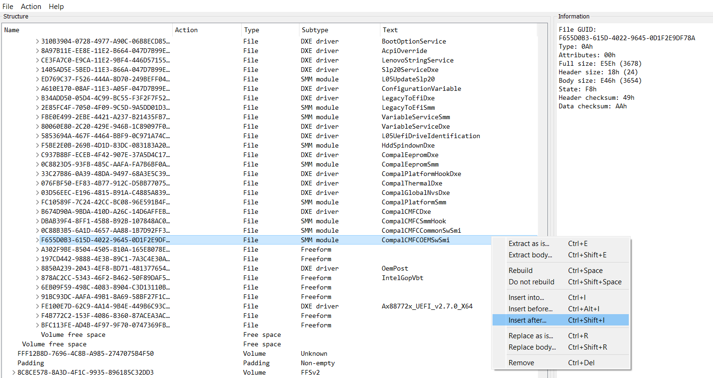
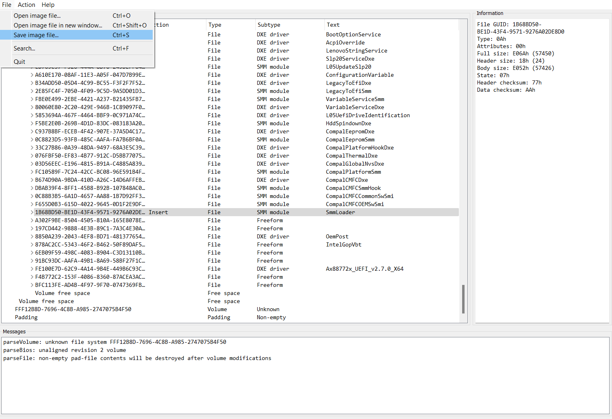
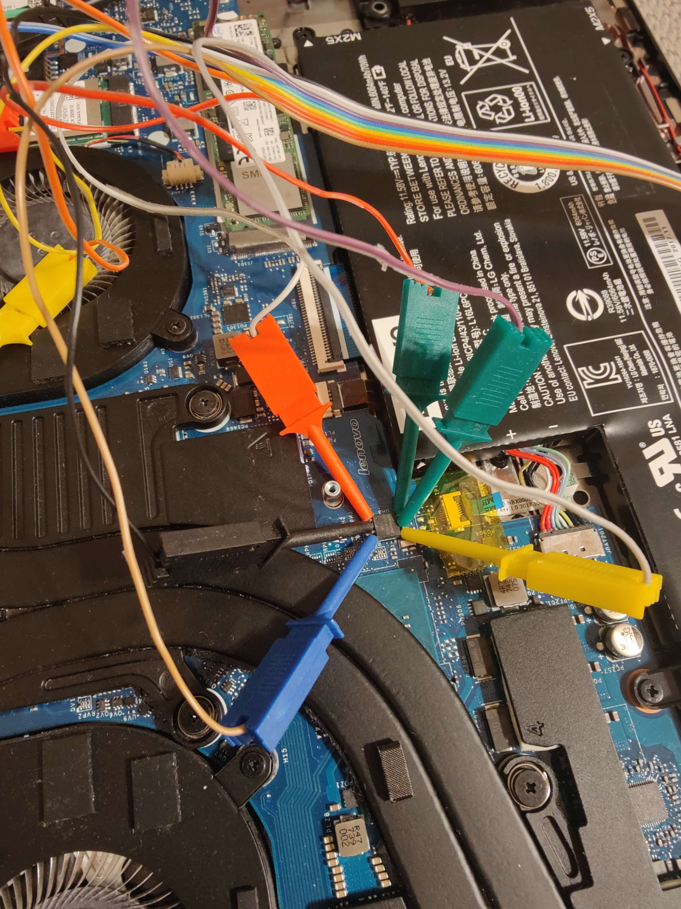

# Overview

SmmLoader is a smm module used to load/unload smm standalone modules during runtime.

# Compilation

SmmLoader requires Visual studio 2019 or higher and EDK2. If you do not have it downloaded [here is a guide for setting it up](https://github.com/tianocore/tianocore.github.io/wiki/Getting-Started-with-EDK-II). After setting up edk2 you can compile SmmLoader:

1. Open command line and head up to edk2 directory and prompt `edksetup.bat`
2. Clone SmmLoader repo
3. Prompt `build -b RELEASE -a X64 -t VS2019 -p SmmLoader/SmmLoader.dsc `

Now SmmLoader should have been succesfully built in edk2/Build/SmmLoader.

# Getting Firmware Image

In order to get firmware image, you need to install [chipsec](https://github.com/chipsec/chipsec) and then run this command as administrator: `python chipsec_util.py spi dump firmware.bin`

# Ebmeding SmmLoader

To embed the SmmLoader in the firmware:

1. Download [UefiTool](https://github.com/LongSoft/UEFITool/releases/tag/0.28.0) version 0.28.0

2. Open your firmware image and find Volume Image Section where all SMM modules are located

3. Find last SMM module

4. Right click on it and select `Insert after...`

   

5. Select either precompiled ffs or the one you have built, you can find it here `edk2/Build/SmmLoader/RELEASE_VS2019/FV/Ffs/1B68BD50-BE1D-43F4-9571-9276A02DE8D0SmmLoader/1B68BD50-BE1D-43F4-9571-9276A02DE8D0.ffs`

6. Save the modified firmware image

   

Now in order to write firmware back to your flash memory:

1. Connect your SPI programmer (in my case it's [Bus Pirate](http://dangerousprototypes.com/docs/Bus_Pirate)) to SPI Flash on your mother board 

   

2. Use [flashrom](https://www.flashrom.org/Flashrom) to writeback firmware by running command `flashrom -VV -p buspirate_spi:dev=COM3 -w infected_firmware.bin` 

3. Disconnect programmer

# Usage

You need to install [chipsec](https://github.com/chipsec/chipsec) so you can communicate with SmmLoader by using SmmLoader.py (Administrator priviligaes required)

Supported commands:

  * SmmLoader.py --load <smm_module_path> - loads a module (currently the maximum number of modules is 16)
  * SmmLoader.py --unload <smm_module> - smm_module must be a file name + extension of file which was loaded using --loads command
  * SmmLoader.py --info - Prints info about all loaded modules (works only if SmmLoader was compiled with DebugLibNvVar)
  * SmmLoader.py --debug - Goes into infinite loop and prints debug messages (works only if SmmLoader was compiled with DebugLibNvVar)

# Writing new smm module

If you want to create new module, you need to append it in SmmLoader.dsc and add `StandaloneMmDriverEntryPoint` and `MmServicesTableLib` library classes.

```
[Components] 
YourModule/YourModule.inf {
  <LibraryClasses>
   StandaloneMmDriverEntryPoint|MdePkg/Library/StandaloneMmDriverEntryPoint/StandaloneMmDriverEntryPoint.inf
   MmServicesTableLib|MdePkg/Library/StandaloneMmServicesTableLib/StandaloneMmServicesTableLib.inf
}
```

Or you can use SampleSmmModule as a template.

Issues and limitations:

1. Smm module must be a of MM_STANDALONE module type because DXE_SMM_DRIVER needs an access to Boot services and Runtime services during execution of it's entrypoint, which are not avalible because we are at runtime. You can read more about differences between these two types of modules [here](https://microsoft.github.io/mu/dyn/mu_feature_mm_supv/MmSupervisorPkg/Docs/StandaloneMmOverview/standalone_mm_framework/).
2. If you want to see debug output in SmmLoader.py, you need to compile your smm module with DebugLibNvVar as your DebugLib Library class (In SmmLoader.dsc it's seleceted as a default one).
3. Be careful with calling DebugPrint inside SmiHandler, because in case of DebugLibNvVar, it uses SmmGetVariable/SmmSetVariable which reads and writes to the DebugBuffer, what can generate a smi that puts you in an infinite loop.

# Example


# Supported hardware & platforms

SmmLoader should work on every hardware and platform supported by chipsec.

# Credits

[SmmBackdoor](https://github.com/Cr4sh/SmmBackdoor) by [Cr4sh](http://blog.cr4.sh/p/blog-page.html)

# License

SmmLoader is under GPLv2 license.